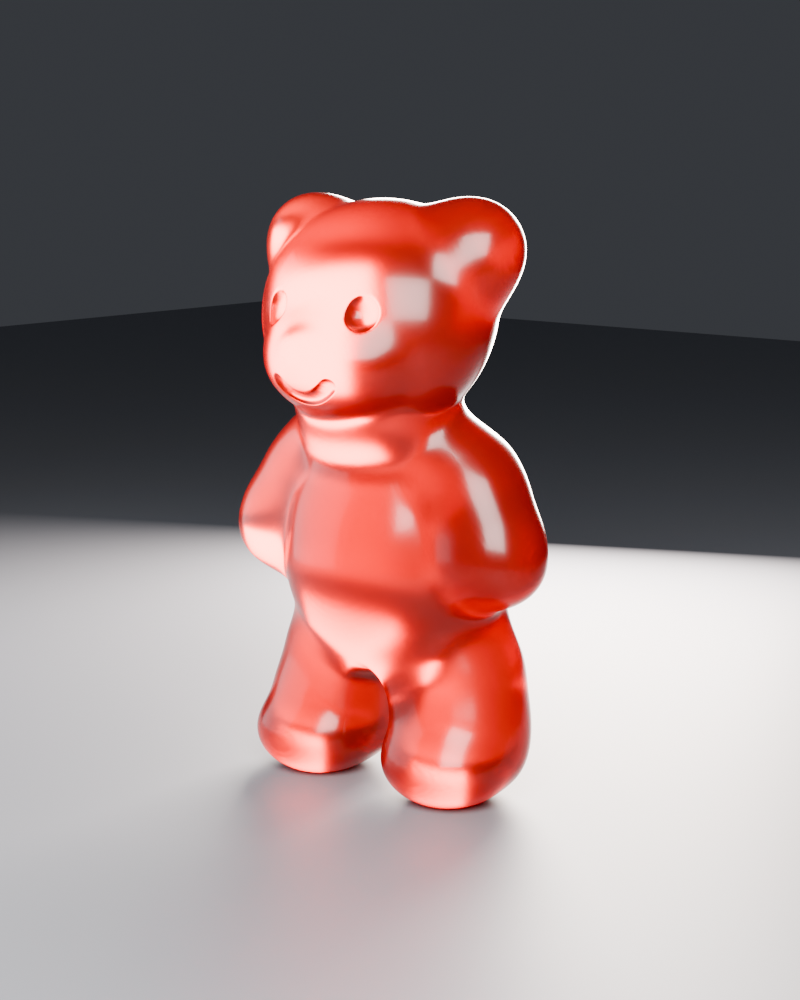

# Gummy Bear

A procedurally built, rigged, and animated gummy bear character PoC. The whole
asset pipeline is scripted: Blender builds the mesh from metaballs, rigs it,
authors the animation loops, and exports a GLB that Godot drives with a
code-built locomotion blend tree.



## Stack

- **Godot 4.7** (Forward+, Jolt Physics) — runtime, character controller, gummy shader
- **Blender** (scripted, headless-friendly) — mesh construction, rigging, animation, GLB export

## Controls

| Input | Action |
|-------|--------|
| WASD  | Walk (forward / back / strafe) |
| Space | Jump (grounded only, no double jump) |
| C     | Cycle gummy colour (cherry, orange, lemon, lime, pineapple) |

## Layout

```
blender/            Asset pipeline scripts (run inside Blender against gummy-bear.blend)
  build_bear.py       Metaball -> remesh -> decimate mesh build (1 m tall, feet on z=0)
  rig_bear.py         Armature + skinning
  walk_actions.py     Four in-place walk loops (24 fps, frames 1-25, shared contact phase)
  animate_bear.py     Legacy idle/walk authoring (superseded by walk_actions.py)
  export_bear.py      Exports assets/bear.glb (idle + 4 walk clips, nothing else)
assets/bear.glb     Exported character consumed by Godot
scenes/             gummy_bear.tscn (character), test_stage.tscn (main scene)
scripts/            gummy_bear.gd (controller), test_stage.gd (dev harness)
shaders/            gummy.gdshader (translucent candy look, rim light, contact fade)
docs/specs/         Design specs
renders/            Blender evidence renders
```

## How it works

- `scripts/gummy_bear.gd` finds the GLB's `AnimationPlayer` at runtime and
  builds an `AnimationTree` with a `BlendSpace2D` in code (idle at the origin,
  the four walk loops on the axes). Blend position is fed directly from
  horizontal velocity; `SYNC_MODE_INDEPENDENT` keeps the phase-locked walk
  cycles from popping on direction changes.
- Movement is a plain `CharacterBody3D`: lerped horizontal velocity (deliberate
  gummy lag), gravity, and a physics-only grounded jump — no jump animation,
  by design (see `docs/specs/2026-08-10-stable-silhouette-space-jump.md`).
- The gummy look is a single material override
  (`materials/gummy_material.tres` + `shaders/gummy.gdshader`) with a
  per-instance colour parameter cycled by the C key.

## Running

Open the project in Godot 4.7 and run — `scenes/test_stage.tscn` is the main
scene.

Headless evidence run (captures screenshots to `.dev/` and validates the jump
contract):

```
godot -- --shots
```

## Rebuilding the asset

Run the scripts in `blender/` against `gummy-bear.blend` (build → rig →
animate → export). Each script is idempotent and `export_bear.py` writes
`assets/bear.glb` without touching the source .blend. Contract: bear is 1 m
tall, feet on the floor, exactly five exported actions (`idle`, `walk_fwd`,
`walk_back`, `walk_left`, `walk_right`).
