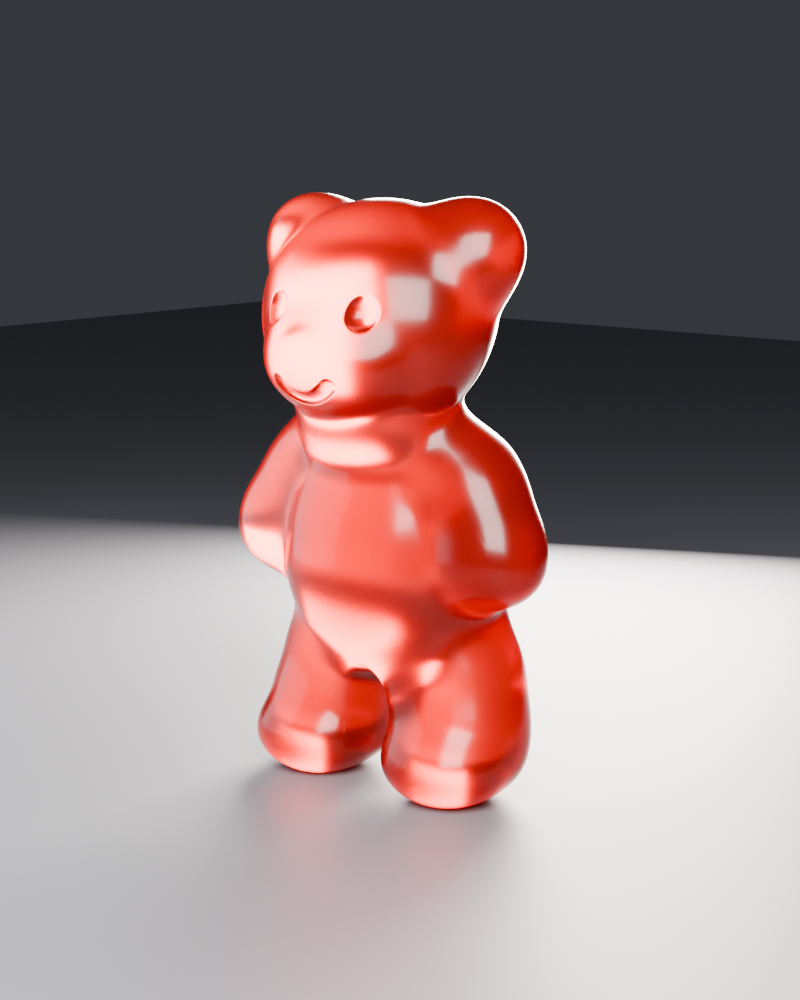

# Gummy Bear

A game for a small child: you're a red gummy bear throwing yellow dodgeballs
at green bears, who flop over in a ragdoll when hit. The mesh and 11-bone rig
live in `gummy-bear.blend`; scripts author the walk loops and export a GLB that
Godot drives with a code-built locomotion blend tree under a mouse-orbit camera.



## Stack

- **Godot 4.7** (Forward+, Jolt Physics) — runtime, character controller, gummy shader
- **Blender** (scripted, headless-friendly) — mesh construction, rigging, animation, GLB export

## Controls

| Keyboard / mouse | Xbox pad | Action |
|------------------|----------|--------|
| WASD  | Left stick | Walk (forward / back / strafe); the stick is analog, up to 2.5 m/s |
| Space | X | Jump (grounded only, no double jump) |
| Left click | A or right trigger | Throw a ball along the camera (every 0.3 s; aim assist bends it toward the green bear under the yellow arrow) |
| Mouse | Right stick | Orbit camera (bear turns to follow while walking); push up to look up |
| Wheel | — | Zoom |
| Esc | Menu (Start) | Pause menu: invert the right stick's up/down (saved to `user://settings.cfg`); Esc, Menu, B or Resume closes it. A left click recaptures the mouse without throwing |
| Enter / Space / click | A | Restart, once every green bear is down and the round button shows |

## Layout

```
blender/            Asset pipeline scripts (run inside Blender against gummy-bear.blend)
  walk_actions.py     Four in-place walk loops (24 fps, frames 1-25, shared contact phase)
  export_bear.py      Exports assets/bear.glb (idle + 4 walk clips, nothing else)
gummy-bear.blend    Source mesh, rig and idle action (hand-maintained)
assets/bear.glb     Exported character consumed by Godot
scenes/             gummy_bear.tscn (shared bear body), player_bear.tscn and
                    green_bear.tscn (inherit it), test_stage.tscn (main scene)
scripts/            gummy_bear.gd (shared body, ragdoll), player_bear.gd (input,
                    throw, aim assist), green_bear.gd (wander/flee),
                    orbit_camera.gd (camera rig), ball.gd, candy_fence.gd,
                    round.gd (win, restart), fireworks.gd, restart_button.gd,
                    pause_menu.gd, settings.gd (saved invert options),
                    test_stage.gd (dev harness)
shaders/            gummy_depth.gdshader (depth pre-pass), gummy.gdshader
                    (translucent candy look, rim light, contact fade)
docs/               Specs, ADRs, plans
renders/            README hero render
```

## How it works

- `scripts/gummy_bear.gd` finds the GLB's `AnimationPlayer` at runtime and
  builds an `AnimationTree` in code: a `BlendSpace2D` (idle at the origin,
  the four walk loops on the axes) feeding a `TimeScale`. Blend position is fed
  body-local horizontal velocity (strafe mode, see
  docs/adr/0001-orbit-camera-strafe-mode.md); above 1 m/s the walks play
  proportionally faster instead. `SYNC_MODE_INDEPENDENT` keeps the
  phase-locked walk cycles from popping on direction changes.
- Movement is a plain `CharacterBody3D`: lerped horizontal velocity (deliberate
  gummy lag), gravity, and a physics-only grounded jump — no jump animation,
  by design (see `docs/specs/2026-08-10-stable-silhouette-space-jump.md`).
- `gummy_bear.gd` is the body every bear shares; subclasses only say where to
  go (`_steer()`). `player_bear.gd` reads input and throws; `green_bear.gd`
  wanders, flees the player within 4 m, and faces where it's heading.
- A throw spawns `ball.gd` (a bouncy `RigidBody3D` on its own physics layer,
  passing through the player). Aim assist lobs it at the best-aligned
  standing green bear, leading its velocity. Any touch knocks a bear down;
  the ball pops after 3 touches.
- A knock starts a ragdoll built in code (`build_ragdoll()`): a
  `PhysicalBoneSimulator3D` whose bones track the animation inertly until
  the hit, then simulate. Jolt needs explicit collision exceptions between a
  bear's own bones, and a `ScaleFix` modifier undoes the rig's 0.333 scale
  leaking into the simulated bones.
- `round.gd` watches the green bears. When the last one goes down, the
  camera tilts up, `fireworks.gd` launches rockets either side of the view,
  and `restart_button.gd` pops up a word-free round button (a drawn ↻) that
  reloads the stage.
- The gummy look is two shader passes on one material
  (`materials/gummy_material.tres`): a depth-only pre-pass
  (`shaders/gummy_depth.gdshader`) writes the bear's nearest-surface depth,
  then its `next_pass` (`shaders/gummy.gdshader`, `render_priority = 1` so it
  draws after the depth pass) shades only the front-most surface, with a
  per-instance colour parameter (the player is cherry red, green bears lime).
  Each bear owns a copy of the two passes, and every frame the bears are
  sorted by camera distance into consecutive `render_priority` pairs, so
  each draws depth then colour back to front. With one shared material, all
  the depth passes drew first and a bear hid the bears behind it.

## Running

Open the project in Godot 4.7 and run — `scenes/test_stage.tscn` is the main
scene.

Evidence run (opens a window; captures
screenshots to `.dev/` and validates the jump contract, the idle/walk
silhouettes, top speed, stick look direction, that an idle bear doesn't turn
when the camera orbits, that a throw knocks a green bear down, turns the
idle player to face it, and keeps the ragdoll on the stage, and that
a green bear behind the translucent player still draws (draw order), and that
knocking every bear down wins the round with fireworks and a focused restart
button, and that the pause menu opens on Start, flips and saves the invert
toggle with A, and closes on B (your saved settings are restored after); the
harness ignores the real mouse while it runs):

```
godot -- --shots
```

## Rebuilding the asset

The mesh, rig and idle action are hand-maintained in `gummy-bear.blend`; there
is no script that rebuilds them. With that file open in Blender, run
`blender/walk_actions.py` (re-authors the four walk loops) and then
`blender/export_bear.py` (writes `assets/bear.glb`). Both scripts validate
their contracts before writing and **save over `gummy-bear.blend`**, so commit
or back up first. Headless:

    blender -b gummy-bear.blend --python blender/walk_actions.py
    blender -b gummy-bear.blend --python blender/export_bear.py

Contract: bear is 1 m tall, feet on the floor, exactly five exported actions
(`idle-loop` plus `walk_{fwd,back,left,right}-loop`), no scale animation.
